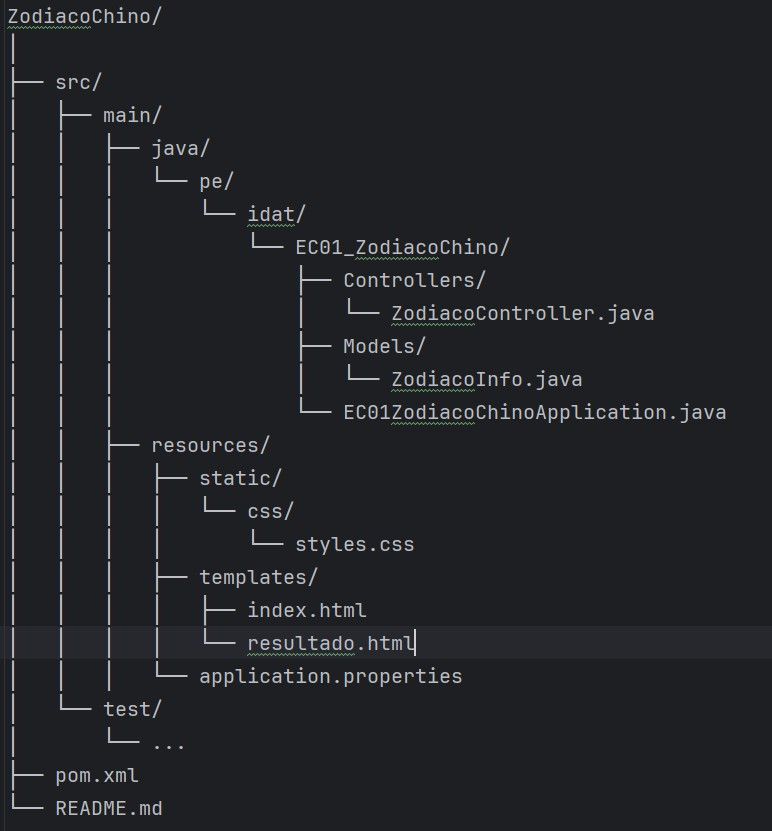
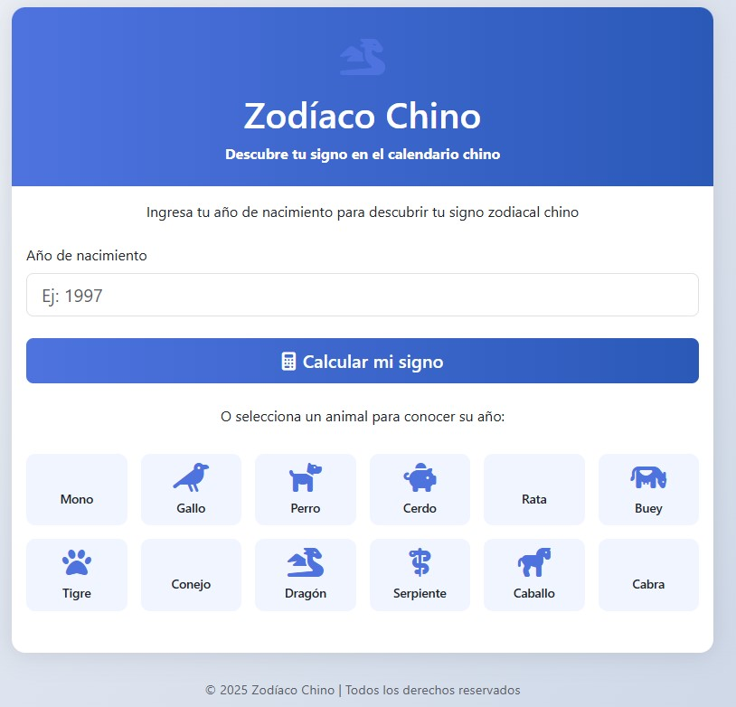
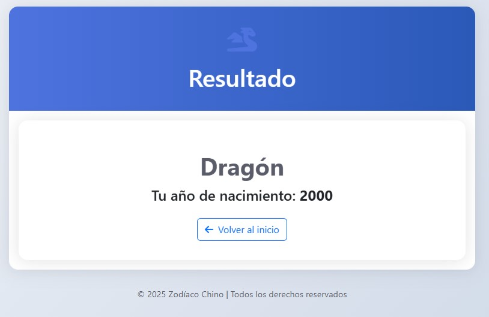

# 🐉 Zodiaco Chino - Proyecto Spring MVC

Este es un proyecto web desarrollado en **Spring Boot (MVC)** que permite al usuario ingresar su año de nacimiento y obtener su **signo del zodiaco chino**, acompañado de una breve **descripción** y un **ícono representativo**.

---

## 🌐 Tecnologías utilizadas

- 🔧 **Spring Boot (MVC)**
- 🎨 **Thymeleaf** (motor de plantillas)
- 💅 **Bootstrap 5** (estilos responsivos)
- ⭐ **Font Awesome 6** (íconos de los signos)
- 🌍 **HTML5 & CSS3**
- 🧪 **Java 21** (puede ajustarse a otras versiones compatibles)

---

## 🚀 Funcionalidad

1. El usuario ingresa su **año de nacimiento**.
2. El sistema calcula su **signo del zodiaco chino** en base al módulo 12 (`año % 12`).
3. Se muestra:
    - El **nombre del signo**.
    - Un **ícono** alusivo.
    - Una **descripción** del signo.
    - El año ingresado.

---

## 📁 Estructura del proyecto



---

## 📝 Clases clave

### `ZodiacoController.java`
Controlador que maneja:
- La ruta `/` (formulario).
- La ruta `/calcular` (procesamiento del año ingresado).

### `ZodiacoInfo.java`
Modelo para representar la información adicional del signo:
- `icon`: clase Font Awesome.
- `description`: texto explicativo del signo.

---

## 💡 Lógica de cálculo

```java
String[] signos = {
    "Mono", "Gallo", "Perro", "Cerdo", "Rata", "Buey",
    "Tigre", "Conejo", "Dragón", "Serpiente", "Caballo", "Cabra"
};

String signo = signos[anio % 12];
 ```
## 🎨 Interfaz de usuario

- `index.html` contiene un formulario diseñado con **Bootstrap 5** para ingresar el año de nacimiento.
- `resultado.html` muestra:
   - El signo del zodiaco chino.
   - Un ícono representativo.
   - Una breve descripción del signo.

- Se utiliza **Bootstrap 5** para lograr una presentación responsiva y moderna.
- Se integran íconos de **Font Awesome 6** para una mejor representación visual del signo del zodiaco.

## ▶️ Cómo ejecutar el proyecto

1. Clona el repositorio:

```bash
git clone https://github.com/inoricode28/ZodiacoChino.git
cd ZodiacoChino
 ```
2. Asegúrate de tener Java 21 y Maven 3.8+ instalados en tu sistema.

3. Ejecuta la aplicación:
```bash
./mvnw spring-boot:run
 ```
4. Abre tu navegador y visita:
```bash
http://localhost:9090
 ```
5. Vista Del Proyecto

   
6. Vista del Resultado
   


